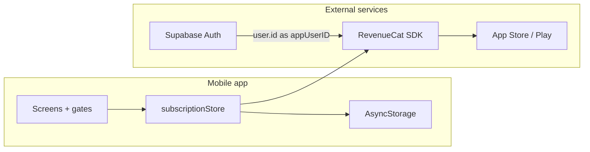

# Subscriptions — Technical Spec

## Architecture



| Responsibility | Owner |
|----------------|-------|
| User identity | Supabase Auth |
| Billing & entitlements | RevenueCat |
| Offline tier cache | AsyncStorage (`muscleos_subscription`) |
| Feature access checks | `subscriptionStore.isPro()` + gates |

## Types

[`packages/types/src/subscription.ts`](../../packages/types/src/subscription.ts):

```ts
type SubscriptionTier = 'basic' | 'pro';
type SubscriptionPlan = 'monthly' | 'annual' | 'lifetime' | null;

interface SubscriptionState {
  tier: SubscriptionTier;
  expiresAt?: string;      // omitted for lifetime
  plan?: SubscriptionPlan;
  isLifetime?: boolean;
}
```

Legacy `tier: 'free'` in AsyncStorage migrates to `'basic'` on read.

## RevenueCat integration

File: [`apps/mobile/src/utils/revenueCat.ts`](../../apps/mobile/src/utils/revenueCat.ts)

- Entitlement: **`MuscleOS Pro`**
- Products: `muscleos_pro_monthly`, `muscleos_pro_annual`, `muscleos_pro_lifetime`
- `getOfferingPackages()` → `{ monthly, annual, lifetime }`
- `purchasePackage(pkg)` → updates `CustomerInfo`
- `hasProEntitlement()` is the source of truth for Pro access
- Lifetime: active entitlement with no `expirationDate` → `isLifetime: true`

Configure API key via `EXPO_PUBLIC_REVENUECAT_API_KEY` in `apps/mobile/.env`.

## Subscription store

File: [`apps/mobile/src/store/subscriptionStore.ts`](../../apps/mobile/src/store/subscriptionStore.ts)

| Method | Purpose |
|--------|---------|
| `load(appUserId?)` | Configure RC, sync from CustomerInfo or dev override |
| `isPro()` | True if tier is pro and not expired (lifetime always true) |
| `purchasePackage(pkg)` | IAP + persist state |
| `restorePurchases()` | Restore from store |
| `setPro()` / `setBasic()` | Dev testing only |

Loaded on app init in [`apps/mobile/app/_layout.tsx`](../../apps/mobile/app/_layout.tsx). Refreshed when app returns to foreground.

## Supabase

File: [`apps/mobile/src/lib/supabase.ts`](../../apps/mobile/src/lib/supabase.ts)

- Anonymous sign-in on first launch
- Account linking (Apple, Google, email) before purchase
- `authStore` calls `revenueCatLogIn(user.id)` after link/sign-in
- **No subscription table in Supabase today** — RC SDK only

### Purchase rule

Anonymous users see **Link account** on the Subscription screen; purchase UI is hidden until linked.

## Phase 2: server-side sync (optional)

Not required for launch.

1. `profiles` table: `subscription_tier`, `plan`, `rc_customer_id`, `updated_at`
2. RevenueCat webhook → Supabase Edge Function (`INITIAL_PURCHASE`, `RENEWAL`, `EXPIRATION`, `CANCELLATION`)
3. Client still prefers RC SDK; Supabase for audit, support, and future cloud backup

## Dev & testing

| Mode | How |
|------|-----|
| Expo Go | RC preview/mock; use **Grant Pro (testing)** |
| Dev build + sandbox | Real IAP with test Apple/Google accounts |
| Env flag | `EXPO_PUBLIC_ENABLE_GRANT_PRO_TESTING=true` |

See [revenuecat-setup.md](revenuecat-setup.md) for dashboard setup steps.
